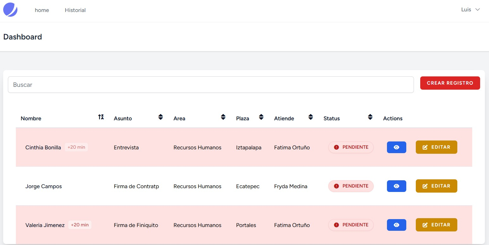
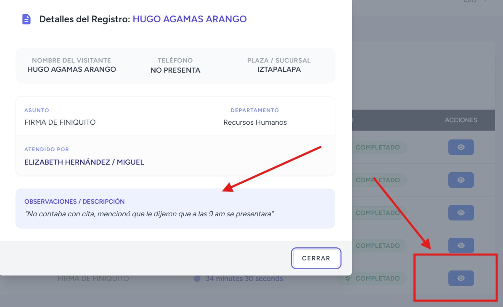

# 🏢 Reception & Visitor Management System

Sistema web integral diseñado para modernizar y automatizar el control de acceso, recepción y auditoría de visitantes en entornos corporativos multi-plaza. El sistema centraliza el registro en recepción y notifica en tiempo real a las áreas correspondientes mediante monitores de estado, midiendo con precisión los tiempos de atención del personal.

---

## 🚀 Características Principales

- **Dashboard de Control en Tiempo Real:** Monitor dinámico para la recepción que permite visualizar el estatus de las visitas actuales ("PENDIENTE", "+20 min"), el asunto de la reunión, la plaza y el colaborador que atiende.
- **Asistente de Análisis de Rendimiento:** Módulo inteligente de analíticas que calcula de forma automática los tiempos promedio de respuesta por personal, destacando picos de máxima productividad o cuellos de botella operativos mediante alertas visuales.
- **Gráficos Estadísticos Interactivos:** Visualización de la distribución de los servicios completados y tiempos promedio a través de componentes gráficos de barras y de dona/pastel.
- **Historial Completo de Auditoría:** Bitácora centralizada con buscadores funcionales para consultar registros completados y sus marcas de tiempo exactas.
- **Módulo de Observaciones Detalladas:** Ventanas emergentes de auditoría interna para registrar incidentes, notas de citas o descripciones particulares de cada visita.
- **Generación de Reportes en PDF:** Extracción automatizada de reportes limpios y estructurados con el historial de registros completados y métricas logísticas para la toma de decisiones directivas.

---

## 🛠️ Stack Tecnológico

- **Backend:** PHP / Laravel (MVC, Arquitectura de Controladores, Rutas y Eloquent ORM)
- **Frontend:** React, JavaScript (ES6+)
- **UI & Estilos:** Tailwind CSS, Librerías de Componentes Web Avanzados
- **Gráficos & Métricas:** Librería de renderizado de gráficos (Charts) integrada en el frontend
- **Base de Datos:** MySQL (Relaciones estrictas entre Plazas, Áreas, Personal y Flujo de Visitas)

---

## 📸 Vista Previa de la Interfaz

### 📋 Dashboard de Monitoreo General

### 📊 Análisis de Rendimiento y Asistente de Eficiencia

### 🔍 Detalle de Registros y Observaciones

### 📈 Historial y Exportación de Reportes

